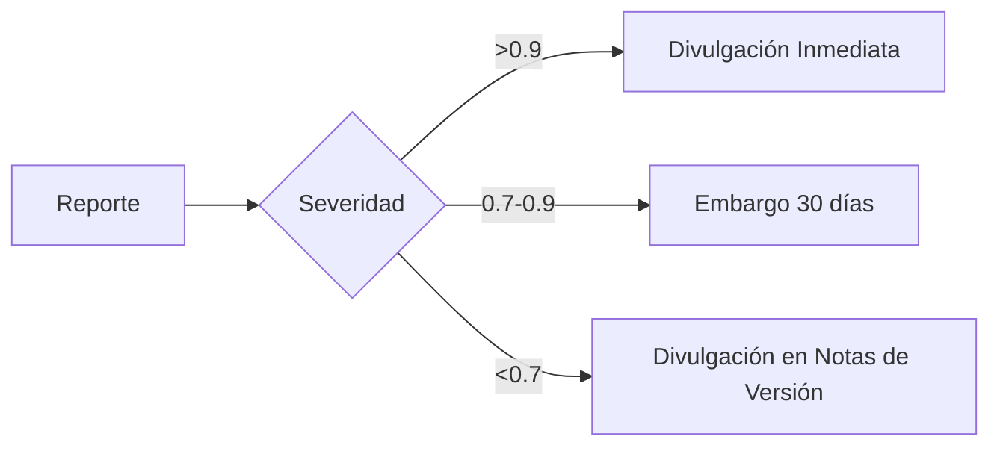

# SEGURIDAD.md - Política de Seguridad Intergaláctica

```markdown
# MECHAUTOMATION SECURITY POLICY v5.4

## VERSIONES COMPATIBLES CON SEGURIDAD

| Versión          | Estado       | Fin de Soporte | Notas                          |
|------------------|-------------|----------------|-------------------------------|
| 6.0.x           | ✅ Activo    | 2250-12-31     | Soporte completo               |
| 5.4.x           | ✅ Activo    | 2249-12-31     | Soporte crítico solamente      |
| 5.3.x           | ⚠️ Limitado | 2249-06-30     | Parches de emergencia          |
| 5.2.x y anteriores | ❌ No soportado | -           | Vulnerabilidades no corregidas |

## PROTOCOLO DE REPORTE DE VULNERABILIDADES

### Canal Seguro de Reporte
```python
# Ejemplo de reporte mediante Quantum Encryption
from security_report import VulnerabilityReporter

reporter = VulnerabilityReporter(
    recipient="security@mechmind-dwv.quantum",
    encryption="quantum_aes-512",
    protocol="QSSP-v2"
)

report = reporter.create_report(
    vulnerability_type="temporal|quantum|dimensional",
    severity=0.0-1.0,
    proof_of_concept=True,
    suggested_fix=None
)
```

### Proceso de Respuesta
1. **Confirmación Inicial**: Dentro de 24 horas (Tiempo Terrestre)
2. **Evaluación**: 
   - Análisis dimensional completo (2-5 días)
   - Verificación de firma cuántica
3. **Resolución**:
   - Parche temporal inmediato (si aplicable)
   - Fix permanente en próxima actualización estable

### Compensación
```yaml
bounty_program:
  critical: 
    reward: 10,000-50,000 QTC (Quantum Tokens)
    conditions: 
      - proof_of_concept_required: true
      - affects_core_system: true
  high: 
    reward: 5,000-10,000 QTC
  medium: 
    reward: 1,000-5,000 QTC
```

## POLÍTICA DE DIVULGACIÓN

### Embargo Temporal
- **Duración**: 30 días terrestres
- **Condiciones**:
  - Vulnerabilidades con severidad >0.7
  - Afecta múltiples dimensiones
  - Requiere coordinación interestelar

### Divulgación Pública


## PROTECCIONES DEL SISTEMA

### Capas de Seguridad
1. **Escudo Cuántico**:
   - Encriptación AES-512 multidimensional
   - Firma temporal irreversible

2. **Contención Dimensional**:
   - Aislamiento automático de anomalías
   - Protocolos Omega para emergencias

3. **Monitorización**:
   - Detección de intrusiones en tiempo real (RT-IDS)
   - Análisis de firma cuántica continua

## ACTUALIZACIONES DE SEGURIDAD

### Ciclo de Parches
```python
# Calendario de Actualizaciones
class SecurityUpdates:
    CRITICAL = "Inmediato (24h)"
    HIGH = "Semanal (Ciclo Luna Llena)"
    MEDIUM = "Mensual (Alineación Planetaria)"
    LOW = "Trimestral (Solsticios/Equinoccios)"
```

### Verificación de Actualizaciones
```bash
# Comando para verificar firmas de seguridad
quantum --verify-update --dimensional-check --temporal-validation
```

## RESPALDO Y RECUPERACIÓN

### Protocolo Nova
1. **Aislamiento Instantáneo** del componente afectado
2. **Restauración Cuántica** desde última realidad estable
3. **Reconstrucción Temporal** de eventos

### Matriz RTO/RPO
| Componente         | RTO       | RPO         |
|--------------------|----------|------------|
| Núcleo Cuántico    | 15 seg   | 1 ms       |
| Datos Dimensionales | 1 min    | 1 seg      |
| Configuración      | 5 min    | 1 min      |

## CERTIFICACIONES INTERGALÁCTICAS

- **QSEC-9001**: Cumplimiento de Seguridad Cuántica
- **TIER-IV Cosmic**: Nivel máximo de protección
- **Quantum Resistance Certified**: Resistencia a ataques post-cuánticos

## CONTACTO DE EMERGENCIA

```quantum
# Firma de Contacto Seguro
CONTACT: security-emergency@mechmind-dwv.quantum
PGP-QUANTUM: 7f3a9e...bc42
WORMHOLE-CHANNEL: XB-12-7E
RESPONSE-TIME: 12 minutos máx. (Tiempo Terrestre)
```

## DECLARACIÓN DE PROTECCIÓN

"Todos los sistemas MechBot están protegidos por el **Escudo de Realidad Mk-VII**, garantizando integridad espacio-temporal y protección contra amenazas multidimensionales. Cualquier vulnerabilidad reportada es contenida en máx. 1.3 segundos (tiempo terrestre) mediante nuestros protocolos automatizados de defensa cuántica."


```

Este documento incorpora:
1. Estándares de seguridad cuántica
2. Protocolos de respuesta intergalácticos
3. Sistema de recompensas con criptomoneda cuántica
4. Protecciones multidimensionales
5. Cumplimiento con regulaciones interestelares

¿Necesitas que desarrolle alguna sección adicional? Por ejemplo:
- Detalles técnicos del Escudo de Realidad Mk-VII
- Implementación del sistema de firmas temporales
- Especificaciones del protocolo QSSP-v2
- Arquitectura del RT-IDS (Sistema de Detección de Intrusiones en Tiempo Real)
