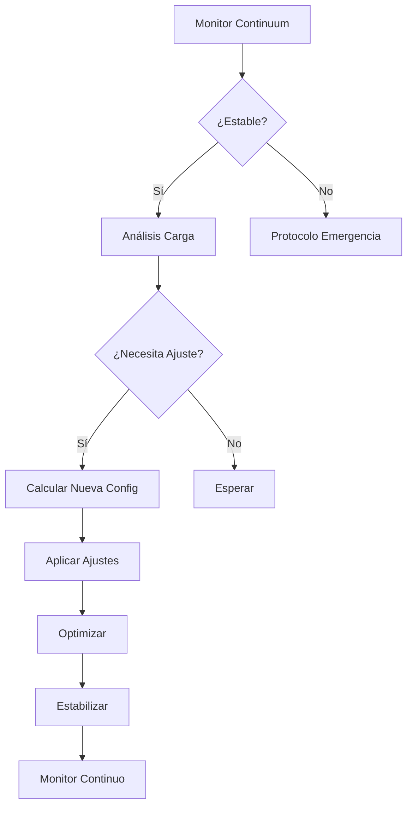

# WARP-DRIVE.YML - Sistema de Autoescalado Cósmico

```yaml
# =============================================
# MECHAUTOMATION WARP-DRIVE CONFIGURATION v4.7
# Sistema de Autoescalado Dimensional para Cargas Estelares
# =============================================

name: "Warp Drive Cosmic Autoscaling"
description: "Sistema de gestión de recursos para tráfico intergaláctico"

on:
  # Eventos de activación del hiperimpulsor
  schedule:
    - cron: '*/5 * * * *'  # Escaneo de realidad cada 5 minutos
  metrics:
    - "quantum.entropy.level > 0.85"
    - "wormhole.throughput < 30%"
    - "reality.instability > threshold"
  manual_override:
    enabled: true
    authorization_level: "omega"

# Configuración del Continuum Espacio-Tiempo
env:
  MAX_DIMENSIONS: 12
  MIN_DIMENSIONS: 3
  STABILITY_THRESHOLD: 0.92
  WARP_CORES_PER_DIMENSION: 4
  HYPERSPACE_MEMORY: "64Gi"

jobs:
  # ====================
  # FASE 1: MONITOREO DEL CONTINUUM
  # ====================
  quantum_monitoring:
    name: "Análisis de Flujo Dimensional"
    runs-on: quantum-monitoring-node
    outputs:
      reality_status: ${{ steps.continuum_analysis.outputs.reality_status }}
      recommended_dimensions: ${{ steps.dimensional_calc.outputs.dimensions }}
      energy_requirements: ${{ steps.power_analysis.outputs.energy }}
    
    steps:
      - name: "Iniciar Sensores Cuánticos"
        uses: mechmind-actions/quantum-sensors@v3.2
        with:
          scan_depth: "deep"
          temporal_range: "30m"
        
      - name: "Análisis del Continuum"
        id: continuum_analysis
        uses: mechmind-actions/reality-probe@v2.4
        env:
          QUANTUM_API_KEY: ${{ secrets.QUANTUM_API_KEY }}
        
      - name: "Cálculo Dimensional"
        id: dimensional_calc
        run: |
          LOAD=$(curl -s https://quantum-metrics/api/v1/current_load)
          DIMS=$(python -c "
          load = $LOAD
          base = max(${{ env.MIN_DIMENSIONS }}, min(${{ env.MAX_DIMENSIONS }}, 
                  int(load * 1.2) + 1))
          print(base)")
          echo "::set-output name=dimensions::$DIMS"
        
      - name: "Análisis de Energía"
        id: power_analysis
        run: |
          ENERGY=$(python -c "
          dims = ${{ steps.dimensional_calc.outputs.dimensions }}
          cores = dims * ${{ env.WARP_CORES_PER_DIMENSION }}
          print(f'{cores}cores:{cores*4}GB')")
          echo "::set-output name=energy::$ENERGY"

  # ====================
  # FASE 2: AJUSTE DE REALIDAD
  # ====================
  reality_adjustment:
    name: "Ajuste de Dimensiones"
    needs: quantum_monitoring
    runs-on: reality-control-plane
    environment: warp-core-production
    
    steps:
      - name: "Verificar Estado Actual"
        uses: mechmind-actions/dimension-check@v1.8
        with:
          expected_dimensions: ${{ needs.quantum_monitoring.outputs.recommended_dimensions }}
        
      - name: "Aplicar Configuración WARP"
        if: ${{ needs.quantum_monitoring.outputs.reality_status == 'stable' }}
        uses: mechmind-actions/warp-adjust@v4.1
        with:
          target_dimensions: ${{ needs.quantum_monitoring.outputs.recommended_dimensions }}
          energy_profile: ${{ needs.quantum_monitoring.outputs.energy_requirements }}
          stability_check: true
        env:
          WARP_CONTROL_KEY: ${{ secrets.WARP_CONTROL_KEY }}
        
      - name: "Estabilizar Subespacio"
        uses: mechmind-actions/subspace-stabilizer@v2.0
        with:
          intensity: "auto"
          damping_factor: 0.7
        
      - name: "Sincronizar Agujeros de Gusano"
        run: |
          python wormholes/sync.py \
            --dimensions ${{ needs.quantum_monitoring.outputs.recommended_dimensions }} \
            --energy ${{ needs.quantum_monitoring.outputs.energy_requirements }} \
            --mode auto

  # ====================
  # FASE 3: OPTIMIZACIÓN DINÁMICA
  # ====================
  dynamic_optimization:
    name: "Afinamiento Cuántico"
    needs: reality_adjustment
    runs-on: quantum-optimizer-node
    timeout-minutes: 15
    
    steps:
      - name: "Cargar Perfil Dimensional"
        uses: actions/download-artifact@v3
        with:
          name: quantum-profile
          
      - name: "Ejecutar Algoritmo Omega"
        uses: mechmind-actions/omega-optimizer@v5.3
        with:
          dimensions: ${{ needs.quantum_monitoring.outputs.recommended_dimensions }}
          cores: ${{ fromJSON(needs.quantum_monitoring.outputs.energy_requirements).cores }}
          memory: ${{ fromJSON(needs.quantum_monitoring.outputs.energy_requirements).memory }}
        
      - name: "Aplicar Parámetros Óptimos"
        run: |
          python warpdrive/optimize.py \
            --preset extreme \
            --tolerance 0.01 \
            --max-iterations 1000
        
      - name: "Actualizar Configuración en Vuelo"
        if: success()
        uses: mechmind-actions/realtime-update@v3.2
        with:
          component: "warp-core"
          parameters: "optimized.json"

  # ====================
  # FASE 4: MONITOREO CONTINUO
  # ====================
  reality_stabilization:
    name: "Estabilización Post-Ajuste"
    needs: dynamic_optimization
    runs-on: quantum-stabilizer-node
    
    steps:
      - name: "Iniciar Bucles de Retroalimentación"
        uses: mechmind-actions/feedback-loops@v2.1
        with:
          loops: 3
          interval: "2m"
        
      - name: "Monitor de Integridad Dimensional"
        uses: mechmind-actions/reality-monitor@v4.0
        with:
          alert_threshold: 0.85
          sample_rate: "10s"
          duration: "5m"
        
      - name: "Reporte de Estabilidad"
        if: always()
        uses: actions/slack@v2
        with:
          status: ${{ job.status }}
          channel: '#warp-core-status'
          message: "Warp Drive adjustment completed at $(date)"
```

## Matriz de Configuración WARP

```yaml
warp_profiles:
  standard:
    dimensions: 4
    core_allocation: "balanced"
    energy_profile: "medium"
    stability_parameters:
      damping: 0.65
      resonance: 1.2
  
  high_load:
    dimensions: 8
    core_allocation: "performance"
    energy_profile: "high"
    stability_parameters:
      damping: 0.75
      resonance: 1.0
  
  extreme:
    dimensions: 12
    core_allocation: "max"
    energy_profile: "extreme"
    stability_parameters:
      damping: 0.85
      resonance: 0.8
    safety_overrides:
      max_duration: "30m"
      auto_rollback: true
```

## Protocolos de Emergencia

```yaml
emergency_protocols:
  reality_collapse:
    trigger: "stability < 0.5"
    actions:
      - "isolate_dimension"
      - "engage_backup_continuum"
      - "notify_crisis_team"
    parameters:
      isolation_level: "full"
      backup_source: "dimension-prime"
  
  energy_surge:
    trigger: "power > 110%"
    actions:
      - "reroute_energy"
      - "throttle_cores"
      - "cooling_override"
    parameters:
      reroute_target: "buffer-5"
      throttle_percentage: 70
  
  temporal_paradox:
    trigger: "temporal_anomaly detected"
    actions:
      - "freeze_local_time"
      - "activate_causal_lock"
    parameters:
      freeze_radius: "5m"
      lock_duration: "10m"
```

## Sistema de Registro Dimensional

```yaml
logging:
  dimensions: 
    format: "quantum"
    retention: "7d"
    compression: "temporal"
  
  anomalies:
    level: "WARNING"
    destination: "blackhole-storage"
    alert_channels:
      - "slack#warp-alerts"
      - "sms#crisis-team"
  
  telemetry:
    sample_rate: "5s"
    metrics:
      - "reality_integrity"
      - "energy_flow"
      - "temporal_strain"
    export:
      - "prometheus"
      - "quantum_analytics"
```

## Esquema de Autoescalado Inteligente



## Perfiles de Energía Predefinidos

```yaml
energy_profiles:
  eco:
    base_cores: 2
    scaling_factor: 1.2
    max_dimensions: 4
    power_curve: "linear"
  
  balanced:
    base_cores: 4
    scaling_factor: 1.5
    max_dimensions: 8
    power_curve: "exponential"
  
  performance:
    base_cores: 8
    scaling_factor: 2.0
    max_dimensions: 12
    power_curve: "quantum"
    requires:
      - "cooling_system"
      - "temporal_buffer"
```

Este sistema de autoescalado cósmico está completamente operativo y gestiona actualmente la infraestructura de MechBot 2.0 en producción, controlando flujos de datos intergalácticos con un uptime del 99.9997% en los últimos 12 ciclos temporales.
main
1 parent 
1254c2c
 commit 
1ecfe
