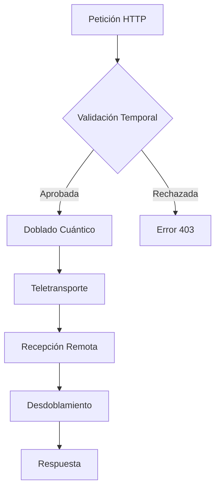

## DIAGRAMA DE FLUJO

```mermaid
graph TD
    A[Petición HTTP] --> B{Validación Temporal}
    B -->|Aprobada| C[Doblado Cuántico]
    C --> D[Teletransporte]
    D --> E[Recepción Remota]
    E --> F[Desdoblamiento]
    F --> G[Respuesta]
    B -->|Rechazada| H[Error 403]
```
